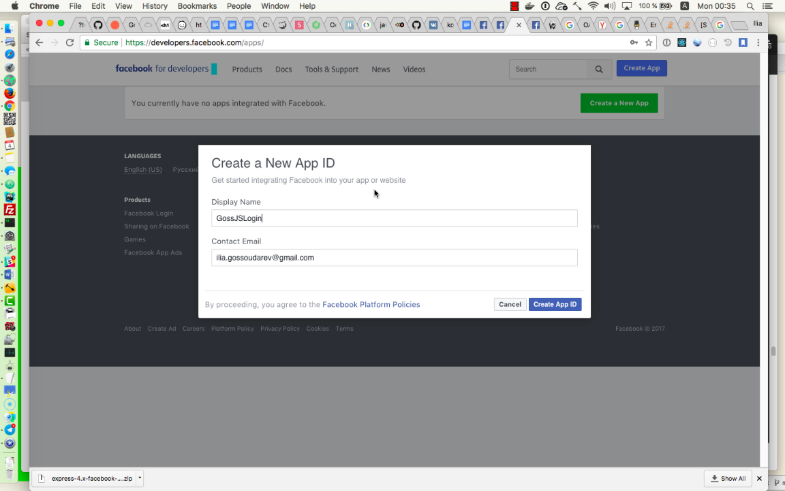
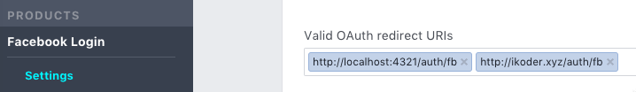
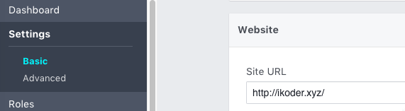

# passport-starters1

В отличие от ветки master здесь используется внешняя стратегия. В наиболее простом варианте за выдачу формы отвечает Facebook, он же отвечает за поиск введённого логина и пароля у себя. При успешной процедуре эта информация передаётся в приложение, и ПаспортJS помещает реквизиты в Request. В этом случае выход из приложения отдельно от Facebook оказывается невозможен.

Т.е. идея внешней стратегии в том, что приложение доверяет внешнему провайдеру идентичности. Разумеется, это положение дел можно усложнить и устроить связывание БД приложения с этим внешним провайдером - т.е. залинковать аккаунты.

Перед запуском этого приложения нужно сперва создать приложение на https://developers.facebook.com/apps/ (Product тип Facebook Login) - интерфейс всё время меняется, поэтому нужно следить за обновлениями. 



В разделе Facebook Login Settings нужно установить  Valid OAuth redirect URIs примерно как на рисунке:



Этому соответствует раздел URL в настройках всего приложения:



Всё это нужно, чтобы получить App ID и App Secret.

После этого можно будет запустить приложение примерно так:

```
CLIENT_ID=319029763162166 CLIENT_SECRET=e5f107e2c9bba18a1e8af4d1541d858e npm start
```

**Для самостоятельного исследования:**

1. Спроектируйте линковку аккаунтов

2. Разберитесь с аналогичной стратегией для Яндекса, а также, по вашему выбору, ещё какого-нибудь провайдера идентичности.

3. Исследуйте, где хранится информация о залогиненном пользователе.
